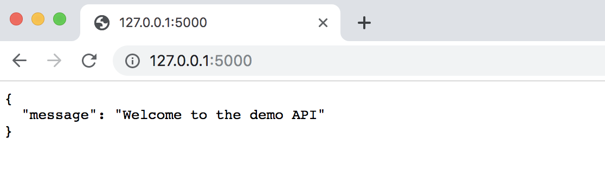
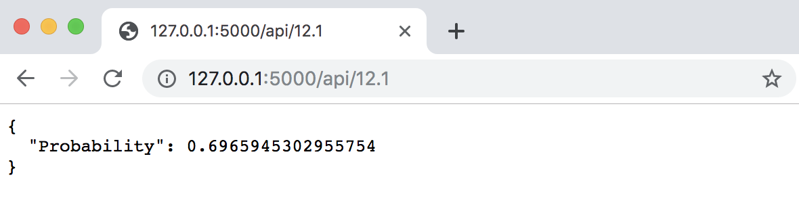
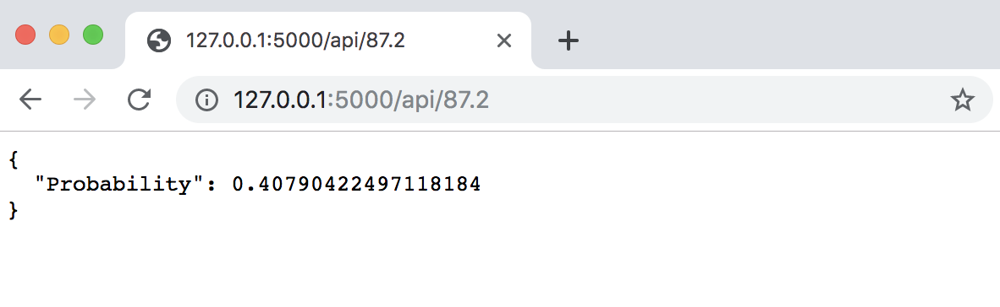
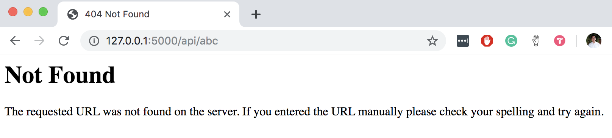

# demo-model-rest-api

Demonstration of how to expose a machine learning model as an API

## Model Creation

A simple logistic regression model was trained on the classic Titanic dataset.
The resulting model was saved as `model.pickle`.

## App

Start up the flask app with `python app.py`.
By default, the app will be running on your localhost, port 5000.
The app reads the model from the pickle file.

## Demo

We can test the app is running by going to `localhost:5000` on your browser.

We can also accept user inputs in the form of `localhost:5000/api/<float: user_input>`

### Example 1

### Example 2

Different inputs will result in different outputs from our model.

### Example 3

In our example, we explicitly expected user inputs to be a float. If the input wasn't provided in the correct type, an error will be thrown.

